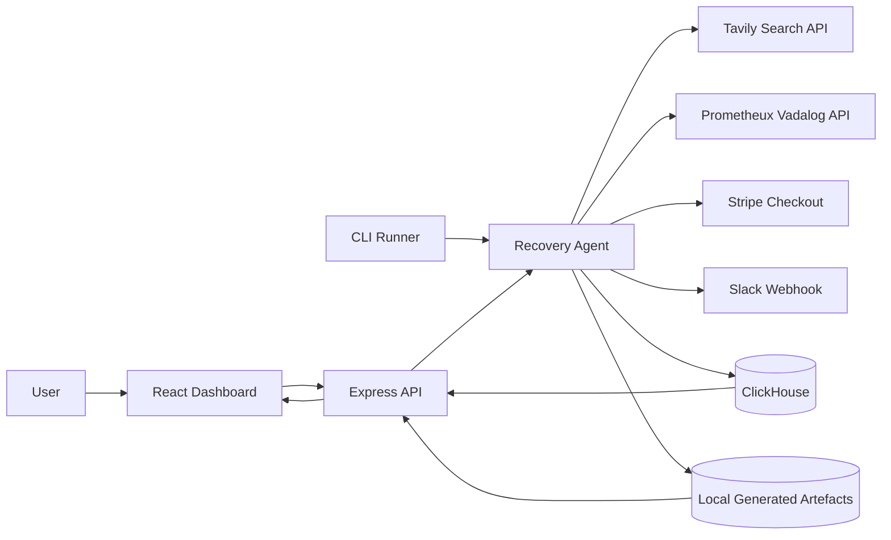
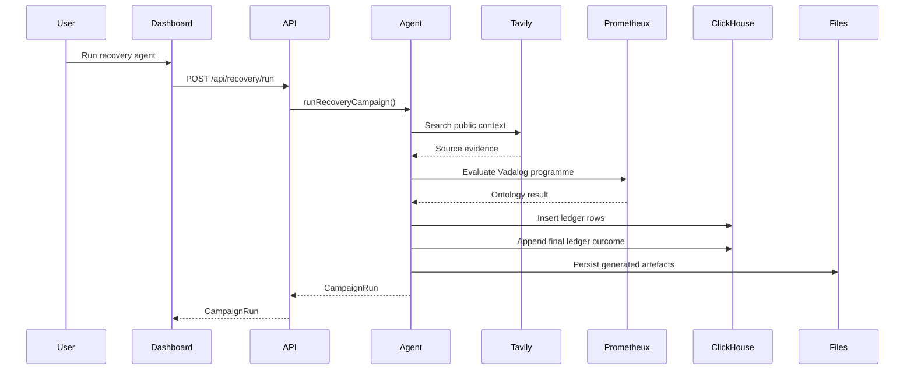

# System Architecture: ClausePay

## Overview

ClausePay is a full-stack demo application for autonomous B2B unpaid invoice recovery. It combines a React dashboard, an Express API, a TypeScript recovery agent, sponsor integrations and local artefact storage.

The system uses synthetic invoice and contract data. Tavily can research a real public company/domain for grounded context, but the app does not assert that the real company owes money.

## Key Requirements

- Run an autonomous recovery campaign from a dashboard or CLI.
- Use live Tavily web research for source grounding.
- Use live Prometheux ontology evaluation for recovery reasoning.
- Use live ClickHouse writes for evidence, actions, traces and workflow state.
- Keep generated emails human-approved rather than automatically sent.
- Preserve a local audit trail under `generated/campaigns/`.
- Degrade safely when Stripe or Slack credentials are absent.

## High-Level Architecture



The dashboard and CLI both call the same recovery agent. The agent coordinates external services, builds the recovery campaign object, writes the operational ledger to ClickHouse, persists local files, and returns the campaign for display.

## Component Details

### React Dashboard

- Responsibilities: run campaigns, display readiness, show sources, trace actions, workflow steps, documents and approval state.
- Main technologies: React 19, Vite, lucide-react, CSS.
- Data owned or transformed: UI state only; campaign data is loaded from the API.
- External dependencies: Express API.
- Failure modes or concerns: long live source text can affect layout, so generated text uses wrapping and responsive constraints.

### Express API

- Responsibilities: expose demo data, readiness, campaign list, individual campaigns and campaign execution.
- Main technologies: Express, TypeScript, Vite middleware in development.
- Data owned or transformed: Zod validates campaign requests before the API passes them to the agent.
- External dependencies: local storage and the recovery agent.
- Failure modes or concerns: no authentication layer is currently implemented; structured API errors include request IDs for debugging.

### Recovery Agent

- Responsibilities: orchestrate invoice recovery, contract clause selection, Tavily research, Prometheux ontology evaluation, payment link creation, Slack notification, ClickHouse persistence and local artefacts.
- Main technologies: TypeScript.
- Data owned or transformed: `CampaignRun`, `RecoveryAction`, `SourceActionTrace`, `CampaignWorkflowStep`.
- External dependencies: Tavily, Prometheux, Stripe, Slack, ClickHouse.
- Failure modes or concerns: external providers may be unavailable; integrations return `completed`, `simulated` or `failed` states.

### ClickHouse Integration

- Responsibilities: create the `recover_ai` database, write/query operational ledger tables and append the final ClickHouse outcome event/action.
- Main technologies: `@clickhouse/client`.
- Data owned or transformed: events, evidence sources, actions, source-action trace and workflow steps.
- External dependencies: ClickHouse Cloud or compatible ClickHouse endpoint.
- Failure modes or concerns: credentials and network availability determine write success.

### Tavily Integration

- Responsibilities: run live web searches for public context and return source URLs/snippets.
- Main technologies: Tavily Search API through `fetch`.
- Data owned or transformed: source evidence records.
- External dependencies: Tavily API key.
- Failure modes or concerns: if the key is absent or the API fails, deterministic fallback sources are returned and marked as simulated/failed.

### Prometheux Integration

- Responsibilities: evaluate the generated Vadalog ontology programme.
- Main technologies: Prometheux `/vadalog/evaluate` API.
- Data owned or transformed: ontology nodes, edges, programme and result payload.
- External dependencies: Prometheux API token and active Prometheux compute.
- Failure modes or concerns: compute must be running; otherwise the API returns `NO_ACTIVE_COMPUTE`.

### Stripe Integration

- Responsibilities: create a test-mode Checkout session when credentials are present.
- Main technologies: Stripe SDK.
- Data owned or transformed: payment link URL and invoice metadata.
- External dependencies: Stripe secret key.
- Failure modes or concerns: currently simulated when `STRIPE_SECRET_KEY` is absent.

### Slack Integration

- Responsibilities: post finance notifications when a webhook is present.
- Main technologies: Slack incoming webhook.
- Data owned or transformed: campaign notification text.
- External dependencies: Slack webhook URL.
- Failure modes or concerns: currently simulated when `SLACK_WEBHOOK_URL` is absent.

## Data Flow



The campaign response is the same object persisted locally as `campaign.json`. ClickHouse is the operational ledger; local files are a demo-friendly artefact trail. The final ClickHouse action is appended after the main write so the ledger records that persistence itself happened.

## Data Model

Core shared types live in `src/shared/types.ts`.

- `Invoice`: synthetic invoice facts.
- `Contract`: synthetic contract and clauses.
- `EvidenceSource`: Tavily or fallback source records.
- `OntologyResult`: generated graph, Vadalog programme and Prometheux result.
- `RecoveryAction`: agent actions and states.
- `SourceActionTrace`: fact-to-action proof chain.
- `CampaignWorkflowStep`: 30-day recovery schedule.
- `CampaignRun`: complete campaign response and persisted artefact.

ClickHouse tables:

- `agent_events`
- `evidence_sources`
- `agent_actions`
- `source_action_trace`
- `workflow_steps`

## Infrastructure and Deployment

The app currently runs locally with:

```bash
npm install
npm run dev
```

Production build:

```bash
npm run build
npm run preview
```

No hosted deployment target is configured yet. Add deployment details as `<ADD DETAIL>` when a target is chosen.

## Scalability and Reliability

- ClickHouse is suitable for high-volume append-only event and evidence records.
- The current Express server is a single-process demo server.
- The agent runs synchronously inside the request/CLI process.
- Long-running workflow execution is modelled, but not yet scheduled by a durable queue.
- External failures are recorded in integration states rather than crashing the dashboard path where possible.
- Tavily, Prometheux and Slack calls use explicit fetch timeouts to avoid hanging a demo request indefinitely.

Future production versions should move long-running campaigns into a durable job runner.

## Security and Compliance

- Secrets are loaded from `.env`, which is ignored by Git.
- The browser does not receive provider secrets.
- The demo has no user authentication or authorisation.
- The debt, invoice and contract are synthetic to avoid making claims about real organisations.
- Outbound email is not automatically sent; approval is local/human-in-the-loop.
- Stripe and Slack are action channels, but are safe simulated fallbacks unless credentials are present.
- ClickHouse records source and action evidence for auditability.
- Third-party provider outputs should be treated as untrusted evidence and reviewed before real-world action.

## Observability

- The dashboard exposes integration states and ClickHouse row counts.
- ClickHouse stores event/action/source/trace/workflow rows.
- Local campaign artefacts preserve the generated brief, email, ontology and ledger.
- There is no central log aggregation or alerting yet.

## Design Decisions and Trade-offs

- Synthetic finance data avoids legal and reputational risk while allowing live web grounding.
- A single TypeScript agent keeps the demo understandable, but a production system should split orchestration, scheduling and provider adapters more formally.
- ClickHouse is used as an append-only ledger, not as the source of invoice truth.
- The dashboard favours traceability and judge visibility over dense enterprise workflow controls.
- Stripe and Slack are integration-ready but intentionally optional so the sponsor demo can run without external side effects.

## Future Improvements

- Add authentication and role-based approval controls.
- Add durable campaign scheduling and retries.
- Add Stripe webhook handling for payment completion.
- Add Slack end-to-end demo credentials and channel controls.
- Add Playwright smoke tests and unit tests for agent builders.
- Add hosted deployment configuration.
- Add richer Prometheux ontology visualisation in the dashboard.
