# ClausePay

Source-grounded contract-to-cash agent for autonomous B2B unpaid invoice recovery.

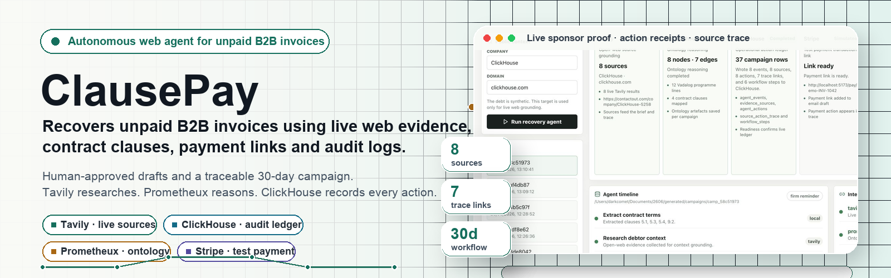

## Description

ClausePay turns an overdue invoice into a traceable recovery campaign. It reads a synthetic invoice and contract, extracts collection-relevant clauses, researches a real public company/domain with Tavily, evaluates the recovery ontology with Prometheux, writes every source and action to ClickHouse, and presents the result in a dashboard with human approval before any outbound email.

The demo invoice, contract and debtor are synthetic. Public web research is used only to demonstrate source-grounded context gathering and does not assert that a real company owes money.

## Table of Contents

- [Features](#features)
- [Tech Stack](#tech-stack)
- [Architecture Overview](#architecture-overview)
- [Installation](#installation)
- [Usage](#usage)
- [Configuration](#configuration)
- [Screenshots or Demo](#screenshots-or-demo)
- [API and CLI Reference](#api-and-cli-reference)
- [Tests](#tests)
- [Roadmap](#roadmap)
- [Contributing](#contributing)
- [Licence](#licence)
- [Contact or Support](#contact-or-support)

## Features

- Live Tavily web research with source URLs.
- Live Prometheux Vadalog ontology evaluation.
- Live ClickHouse writes for events, evidence, actions, source-action trace and workflow steps.
- Judge-facing dashboard for running and reviewing recovery campaigns.
- CLI workflow for generating logs and artefacts.
- Source-to-action trace linking invoice facts, contract clauses, web sources and agent actions.
- Interactive 30-day autonomous recovery workflow with ClickHouse-backed step advancement.
- Human approval marker for generated collection emails.
- Stripe and Slack integration adapters with safe simulated fallback when credentials are absent.

## Tech Stack

- Node.js 24 tested locally.
- TypeScript.
- React 19.
- Vite.
- Express.
- ClickHouse JavaScript client.
- Tavily Search API.
- Prometheux Vadalog API.
- Stripe SDK.
- Slack incoming webhooks.

## Architecture Overview

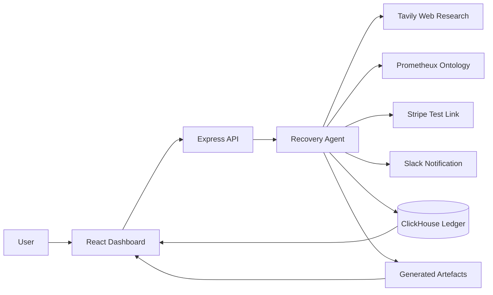

The React dashboard calls the Express API to start a campaign. The agent coordinates contract extraction, Tavily research, Prometheux ontology evaluation, action generation, ClickHouse persistence and local artefact generation. The dashboard then displays the action ledger, grounding sources, source-to-action trace, workflow plan and generated documents.

## Installation

```bash
npm install
cp .env.example .env
npm run dev
```

Open `http://localhost:5173`.

Hosted demo:

```text
https://clausepay.vercel.app
```

## Usage

Run the dashboard:

```bash
npm run dev
```

Run the agent workflow from the CLI:

```bash
npm run agent:demo
```

Create a production build:

```bash
npm run build
```

Preview the production server after building:

```bash
npm run preview
```

## Configuration

Copy `.env.example` to `.env` and fill in the credentials you need.

| Variable | Purpose |
|---|---|
| `TAVILY_API_KEY` | Enables live open-web source research. |
| `TAVILY_PROJECT` | Optional Tavily project/session grouping. |
| `CLICKHOUSE_URL` | ClickHouse HTTPS endpoint. |
| `CLICKHOUSE_USERNAME` | ClickHouse username, usually `default`. |
| `CLICKHOUSE_PASSWORD` | ClickHouse password. |
| `CLICKHOUSE_DATABASE` | Database for recovery ledger tables. Defaults to `recover_ai`. |
| `STRIPE_SECRET_KEY` | Enables real Stripe test-mode Checkout sessions. |
| `PUBLIC_BASE_URL` | Base URL used for payment success/cancel URLs. |
| `SLACK_WEBHOOK_URL` | Enables Slack notification posting. |
| `PROMETHEUX_ENGINE_URL` | Prometheux API base URL, expected to expose `/vadalog/evaluate`. |
| `PROMETHEUX_API_TOKEN` | Prometheux bearer token. |
| `DEMO_PUBLIC_COMPANY_NAME` | Public company name used for web context only. |
| `DEMO_PUBLIC_COMPANY_DOMAIN` | Public domain used for web context only. |

Never commit `.env`. It is ignored by Git.

## Screenshots or Demo

### Animated Demo GIFs

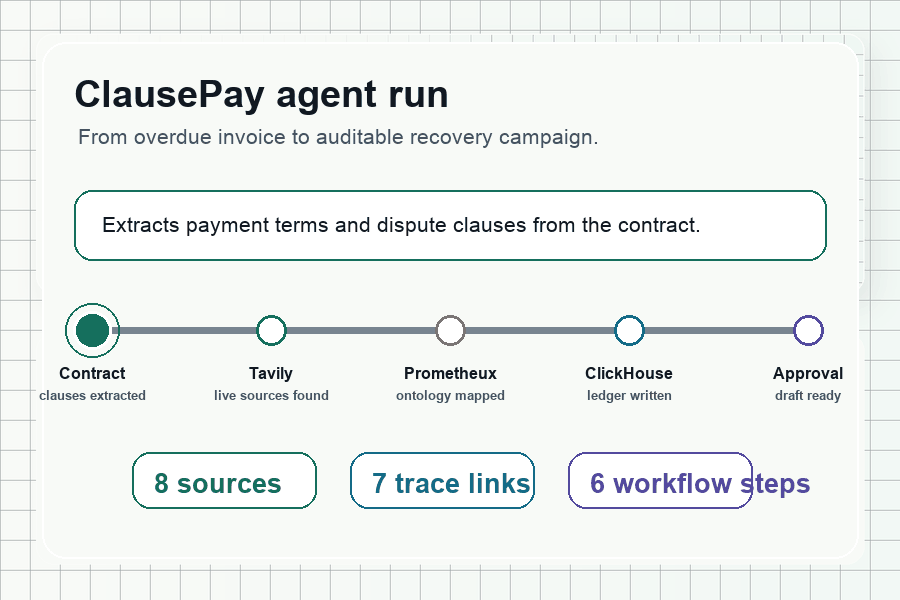

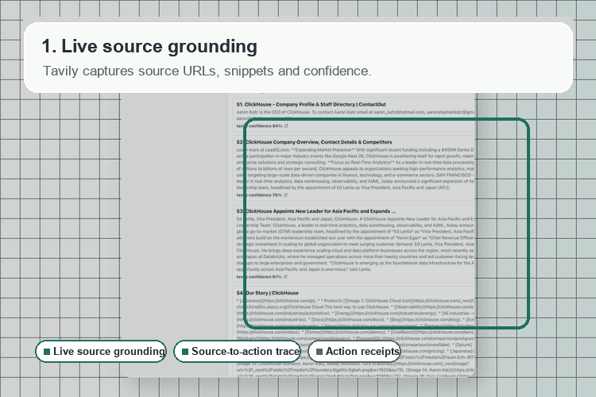

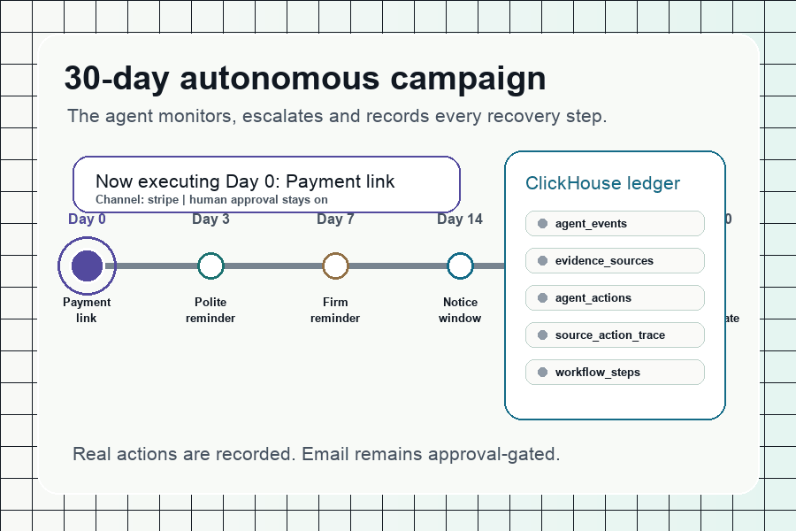

### Dashboard Overview

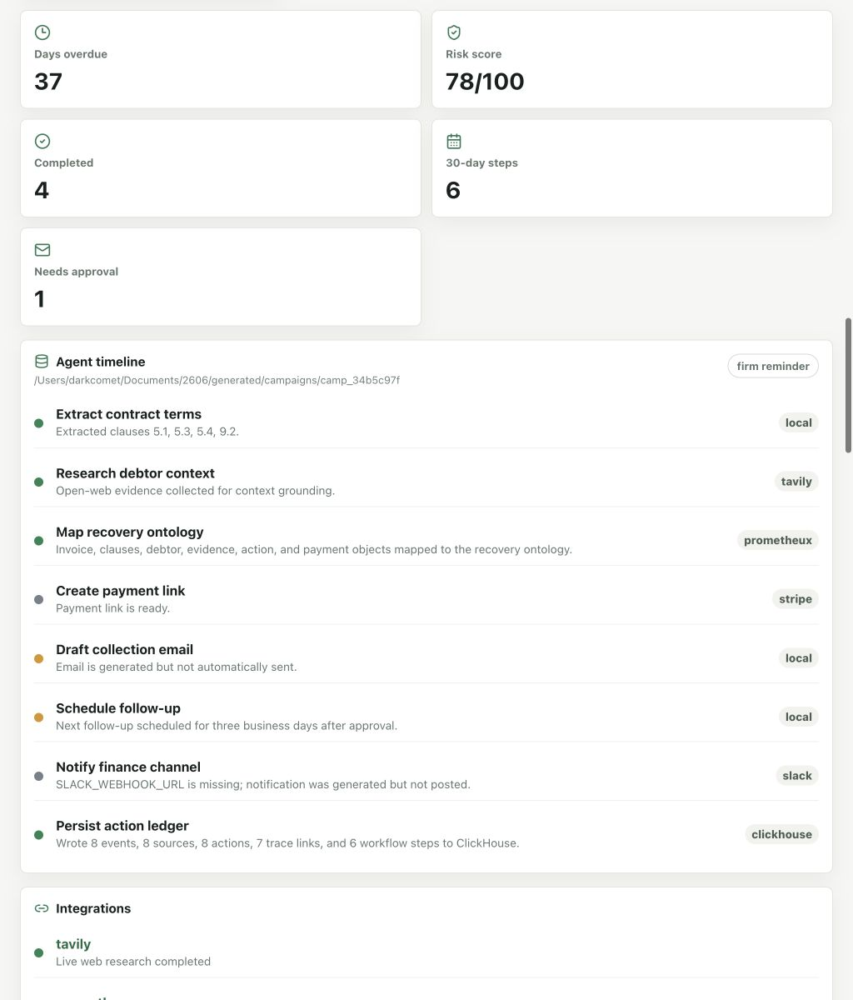

### Sponsor Proof

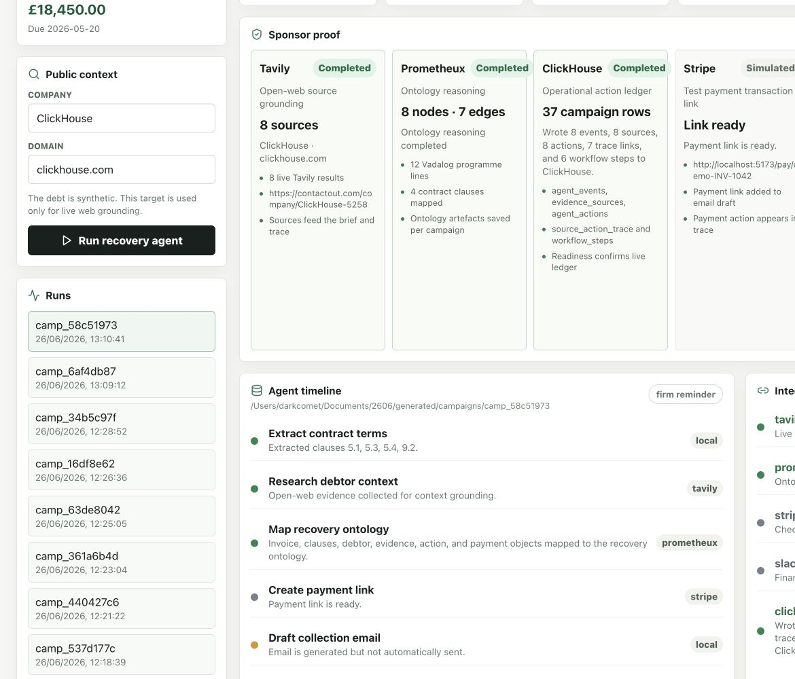

### Action Receipts

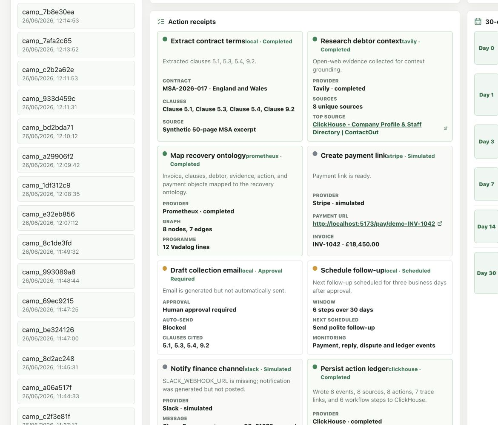

### Source-to-Action Trace

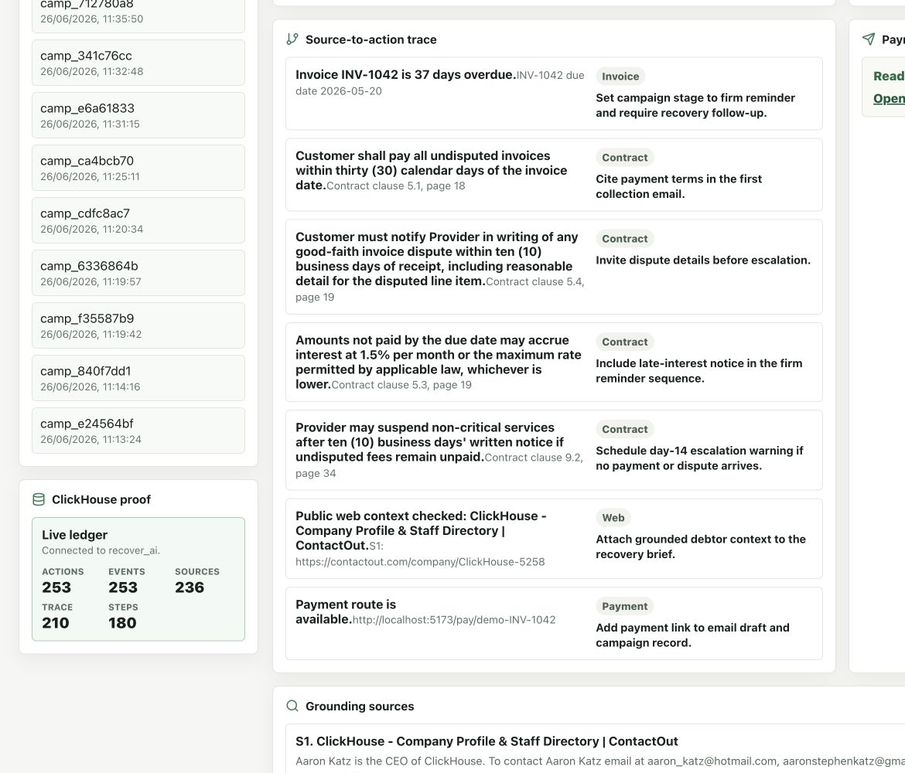

### Grounding Sources

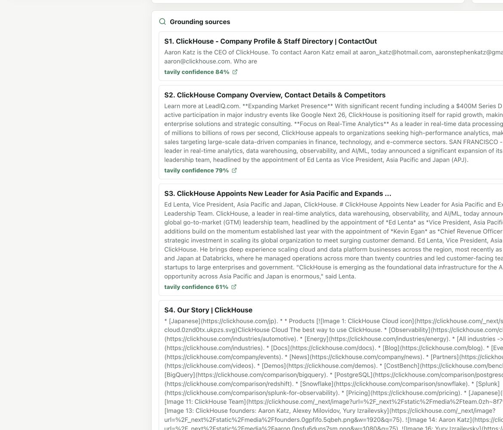

### Approval Documents

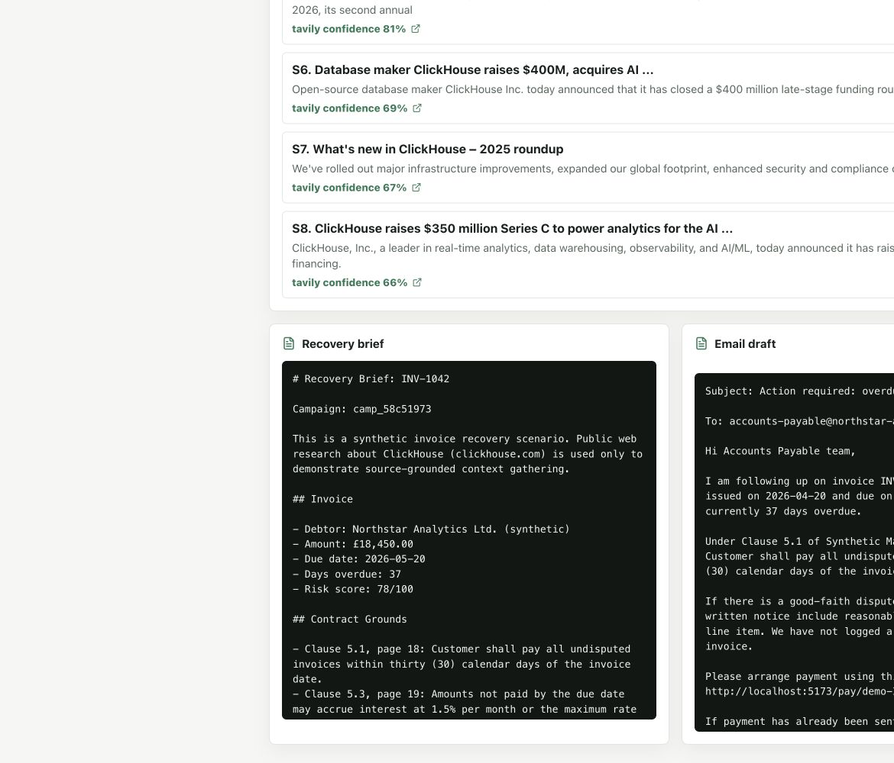

Local dashboard:

```text
http://localhost:5173
```

Hosted dashboard:

```text
https://clausepay.vercel.app
```

Key dashboard panels:

- Invoice and public context.
- ClickHouse proof.
- Agent timeline.
- Sponsor proof.
- Action receipts.
- 30-day workflow.
- Source-to-action trace.
- Grounding sources.
- Recovery brief.
- Email draft requiring human approval.

## API and CLI Reference

### API

| Method | Route | Description |
|---|---|---|
| `GET` | `/api/demo` | Returns demo invoice, contract, public context and environment readiness. |
| `GET` | `/api/readiness` | Returns ClickHouse readiness and ledger row counts. |
| `GET` | `/api/campaigns` | Lists locally generated campaigns. |
| `GET` | `/api/campaigns/:id` | Returns one generated campaign. |
| `POST` | `/api/recovery/run` | Runs a recovery campaign. |
| `POST` | `/api/campaigns/:id/advance` | Advances the next 30-day workflow step and appends the event/action/step to ClickHouse. |

Example run request:

```bash
curl -X POST http://localhost:5173/api/recovery/run \
  -H 'Content-Type: application/json' \
  -d '{"researchCompanyName":"ClickHouse","researchDomain":"clickhouse.com"}'
```

### CLI

```bash
npm run agent:demo
```

The CLI writes files under `generated/campaigns/<campaign-id>/`:

- `campaign.json`
- `brief.md`
- `email.md`
- `ontology.vadalog`
- `ontology.json`
- `source-action-trace.json`
- `workflow.json`
- `ledger.jsonl`

Generated campaign files are ignored by Git.

## Tests

Current verification commands:

```bash
npm test
npm run typecheck
npm run build
npm run agent:demo
npm run test:smoke
```

`npm test` runs type-checking and a production build. `npm run test:smoke` runs a campaign, validates the generated shape, checks approval gating, confirms generated artefacts exist and verifies the final ClickHouse ledger detail. If live Tavily, Prometheux or ClickHouse credentials are configured, the smoke test expects those integrations to complete.

Manual smoke test:

1. Start the app with `npm run dev`.
2. Open `http://localhost:5173`.
3. Click `Run recovery agent`.
4. Confirm Tavily, Prometheux and ClickHouse show completed states.
5. Click `Advance campaign day`.
6. Confirm action receipts add a workflow advancement and ClickHouse proof increments row counts.

## Roadmap

- Add automated unit tests for agent builders and integration adapters.
- Add Playwright dashboard smoke tests.
- Add Stripe test-mode payment completion handling.
- Add Slack webhook end-to-end demo mode.
- Add richer Prometheux ontology visualisation.
- Add a deployment target and hosted demo URL.

## Contributing

Issues and pull requests are welcome. Keep changes focused, avoid committing generated campaigns or secrets, and run the verification commands before opening a pull request.

## Licence

`<ADD LICENSE>`

## Contact or Support

Repository: `https://github.com/MasteraSnackin/ClausePay`
